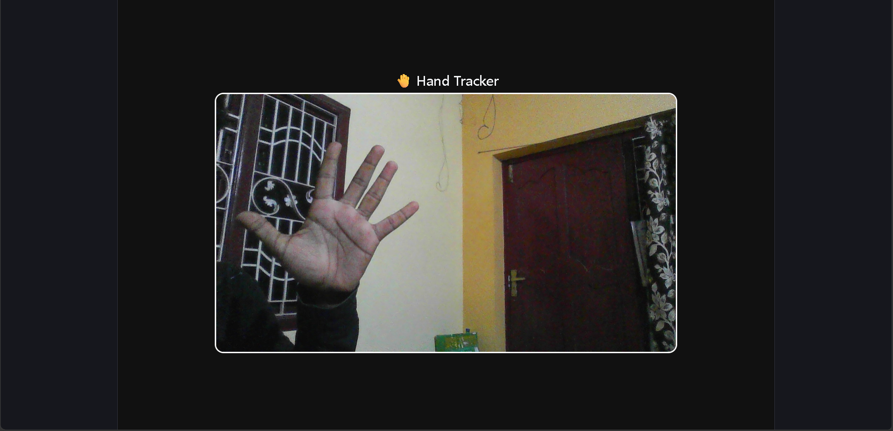
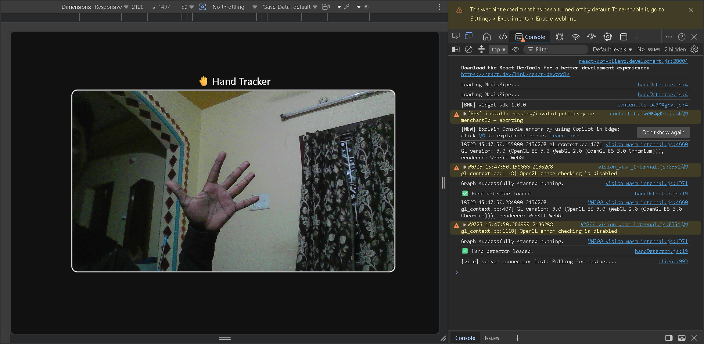
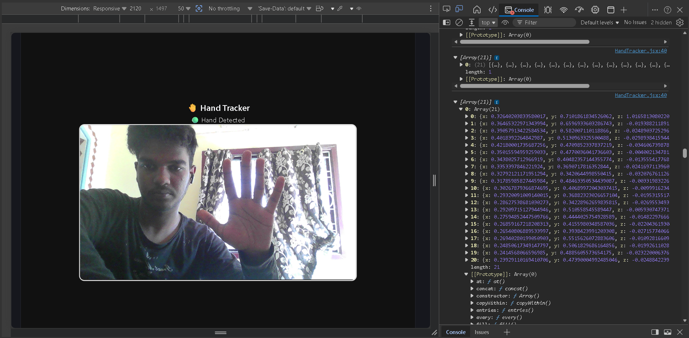

# GesturePlay 🎮

An AI-powered gesture-controlled gaming platform that allows users to play games using hand gestures detected through a webcam.

## Tech Stack

- React
- FastAPI
- OpenCV
- MediaPipe
- TensorFlow (later)

## Features

- [ ] Webcam Integration
- [ ] Hand Detection
- [ ] Gesture Recognition
- [ ] Browser Game
- [ ] AI Model Training
- [ ] Real-Time Gesture Control

## Progress
- ✅ Day 1 – Project Setup
- ✅ Day 2 – React + Webcam Integration
- ✅ Day 3 – Live Webcam in HandTracker
- ✅ Day 4 – MediaPipe Hand Detector Initialized
- ✅ Day 5 – Real-time Hand Landmark Detection (21 Points)
- 🔄 Day 6 – Draw Hand Skeleton (Coming Next)

## Screenshots

### Day 3 – Live Webcam

## Day 4 - MediaPipe Initialization

### Features
- Installed MediaPipe Tasks Vision
- Loaded HandLandmarker model
- Successfully initialized hand detector
- Live webcam feed running

### Screenshot

### Day 5 – Hand Landmark Detection

#### Features
- Successfully detected a hand in real time using MediaPipe.
- Extracted all **21 hand landmark coordinates**.
- Displayed **Hand Detected / No Hand** status dynamically.
- Logged landmark coordinates (`x`, `y`, `z`) to the browser console.
- Built the foundation for gesture recognition and hand skeleton visualization.

### screenshot

